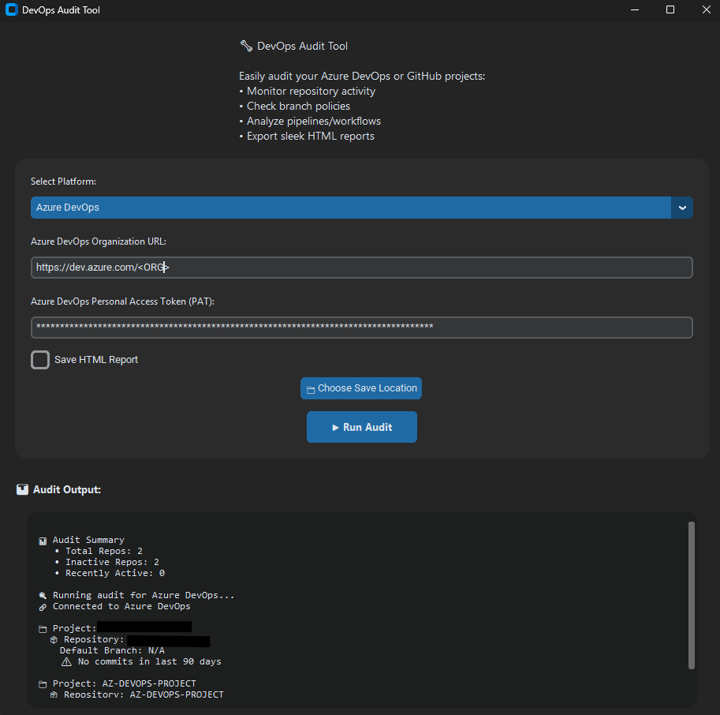

# 🚀 DevCheckr

**DevCheckr** is a modern, GUI-based Azure Devops and GitHub auditing tool built for developers, DevOps engineers, platform teams, and security-conscious organizations who want fast visibility into the health and activity of their repositories.

Whether you're managing a small team or auditing a large Azure Devops and GitHub organization, **DevCheckr** helps you spot inactive projects, understand repository status, and export clean reports — all from an intuitive desktop interface.

---

## ✨ Features

- 🔍 **Repository Activity Insights**  
  Quickly scan repositories for recent activity based on commit history. Identify inactive or stale projects with one click.

- 🌐 **Public & Private Repository Support**  
  DevCheckr uses your Azure Devops and GitHub Personal Access Token (PAT) to scan both public and private repositories you have access to.

- 🧠 **Default Branch Detection**  
  View the default branch (`main`, `master`, etc.) for each repository at a glance.

- 📊 **Audit Summary Report**  
  Automatically generated summary showing total, active, and inactive repos.

- 💾 **HTML Export**  
  Export sleek, readable audit reports in HTML format for sharing or archiving.

- 🧩 **Secure & Offline-Ready**  
  Your PAT is used locally, and no data is sent or stored externally. Perfect for secure environments.

---

## 🔧 Requirements

- Python **3.9+**
- A GitHub [Personal Access Token (PAT)](https://github.com/settings/tokens) with:
  - ✅ `repo` scope for publi repository access
  - ✅ `read:org` scope (optional) for scanning org-wide repos
- Internet access to call the GitHub REST API

---

## 📦 Installation

1. **Clone the repository** (if hosted on GitHub):

   ```bash
   git clone https://github.com/yourname/devcheckr.git
   cd devcheckr
   ```

2. **Install dependencies**:

   ```bash
   pip install -r requirements.txt
   ```

3. **Run the app**:

   ```bash
   python src/devcheckr.py
   ```

---

## 🎥 Usage

Here’s a guide of what DevCheckr can do:

1. **Launch the tool**:  
   Open the DevCheckr app, enter your Azure Devops and GitHub organization or username, and paste your **PAT**.

2. **Run the audit**:  
   Click "Run Audit", and DevCheckr will fetch and display repository details, activity, and branch info.

3. **View the Summary Report**:  
   Instantly see a clean, readable summary of your GiAzure Devops and GitHub repositories — total repos, active vs inactive, and last commit date.

4. **Export the results**:  
   One-click export generates an HTML report that you can share or archive.

---

## 📸 Screenshot



---

## 🛡 License

This project is licensed under the [MIT License](LICENSE).
